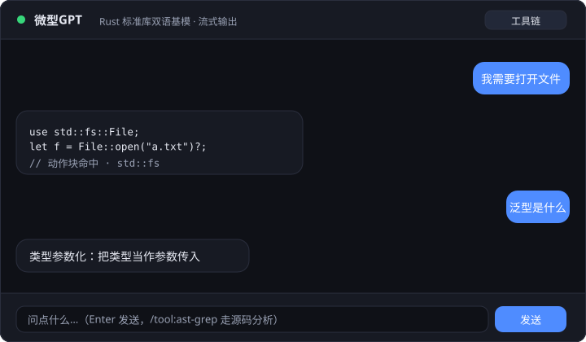

<div align="center">

# 微型GPT · lyco_chat

**从零实现的纯 Rust Transformer：BitNet 1.58bit 量化 + 双 MoE + 9 层知识路由**

一个**会诚实说「不会」**的 Rust 标准库双语问答助手

[](LICENSE)
[](https://www.rust-lang.org)
[](TEST_REPORT.md)
[](https://github.com/lilyco-42/lyco_chat/releases)

</div>

---

<p align="center">
  
</p>

<p align="center">
  问「我需要打开文件」→ 直接给出 <code>File::open</code> 代码，而不是一段似是而非的解释。
</p>

---

## 它解决什么问题

通用大模型回答「Rust 怎么打开文件」时，倾向于生成一段通顺但**可能编译不过**的代码。
这个项目走了相反的路：

> **模型不兜底生成。** 一个 9 层决策链先把问题路由到确定性的知识源
> （词典 / 概念 / 动作块 / crate 真实标签 / crates.io 实时搜索 / 源码扫描），
> 路由全部落空时**诚实说「暂时不会」**，然后把没答上的词记进 `data/learned.json` 自动学习。

所以它答得窄，但答出来的东西是**能用的**。

**技术含量在「小」上** —— 这是个刻意做小的系统，每一层都可验证：

| | 参数 |
|---|---|
| 模型 | `embed_dim=64`、`n_layers=4`、`n_heads=4`、`block_size=16`（`src/config.json`） |
| 语料 | 1738 行中英对照，词表 1230 |
| 量化 | BitNet 1.58bit 三元权重，与 `microsoft/BitNet` i2_s **逐位对齐**（16 个测试守着） |
| 测试 | **220 通过 / 0 失败**，覆盖 29 个模块 |

---

## 60 秒跑起来

```bash
git clone https://github.com/lilyco-42/lyco_chat.git
cd lyco_chat
cargo build --release -j 8

# 直接跑。首次运行会自动训练基模（CPU，15000 步）并保存到 model/base_gpu.json
./target/release/demo_chat
```

之后每次启动会直接加载 `model/base_gpu.json`，**不再重复训练**。

启动 Web 界面：

```bash
./target/release/demo_chat --config server.toml
# 打开 http://127.0.0.1:8080
```

> **基模权重不在仓库里**（`.gitignore` 忽略 `model/`，约 5.7MB），首次运行自动训练生成。
> 想用显卡训练：先 `cargo build --release --features cuda`，再把配置里的
> `train_backend` 改成 `candle`。

---

## 效果一览

下面每一行都是 `cargo test` 里的**真实回归用例**，不是挑出来的好例子：

| 提问 | 实际回答 |
|---|---|
| 我需要打开文件 | `use std::fs::File; File::open("a.txt")?;` |
| 怎么删除文件 | `std::fs::remove_file(...)` |
| 如何定义结构体 | `struct S { ... }` |
| 怎么生成随机数 | `cargo add rand` |
| 泛型是什么 | 词典释义：类型参数化 |
| 怎么写爬虫 | 转译 crawler → 查 crates.io → 推荐并记住 |
| 我需要的是 axum 里面的 | crate axum 描述（http / routing / web），**不会**去解释「crate」这个词 |
| axum 帮我找找怎么新建路由 | 委派动态专家扫 axum 源码，给出 `new` / `route` 等 `pub fn` + 文档 |
| `/tool:ast-grep tokio 怎么创建异步任务` | 斜杠工具，直接做源码分析 |
| **中午吃什么** | **诚实「暂时不会」**，并把生词记下来 |

最后一行的设计是这个项目最不一样的地方：**宁可答不上，也不编。**

---

## 架构

```
┌────────────────────────────────────────────────────────────┐
│  TinyGPT<L>  L: LinearLike (Linear | BitLinear)            │
│  Token Embedding + Position Embedding → Block×N → LayerNorm │
│  Block = MultiHeadAttention → FeedForward                   │
│  │                                                          │
│  ├── BitNet  量化权重 (absmean 三元 → 2-bit 打包)            │
│  ├── Colibrì MoE  PackedExpert / ExpertStore / SparseBitMoE │
│  └── SharedSparseMoE  shared + top-k (DeepSeek)             │
├────────────────────────────────────────────────────────────┤
│  candle_trainer  CandleGPT (CUDA 训练 / 推理, 权重双向转换)   │
├────────────────────────────────────────────────────────────┤
│  RouterStack  9 层决策链 + Learner 自动学习                  │
│  serve         OpenAI SSE / chat.html / /tool:ast-grep      │
└────────────────────────────────────────────────────────────┘
```

### 9 层知识路由（`src/core/router.rs`）

```
crate 专家 → 词典释义 → 概念代码 → 动作块 → 标签激活(crate 真实标签)
→ 意图注意力 → crates.io 实时搜索 → 动态 ast-grep 专家 → 兜底 + 自学习
```

**动态 ast-grep 专家**是这里最有意思的一环：本地 registry 找不到就自动从 crates.io
下载 crate 源码，用 jieba 抓意图关键词，扫 `pub fn` 和文档，再按
（名字命中 / 文档 / 签名 / 引用权重）排序回答。所以它给的函数签名是**从真实源码里读出来的**。

### 模块速览（`src/core/`）

| 模块 | 作用 |
|---|---|
| `tiny_gpt.rs` `linear.rs` `head.rs` `attention.rs` `feed_forward.rs` | 泛型化 Transformer（`LinearLike` 双后端） |
| `bitnet.rs` | BitNet 1.58bit 量化 + 整数 LUT 矩阵乘 |
| `moe.rs` | Colibrì 风格打包 MoE + 专家缓存（LRU 热度 / 预取） |
| `moe_model.rs` | SharedSparseMoE 共享专家 + top-k 路由 |
| `candle_trainer.rs` | CandleGPT CUDA 训练 / 推理 / CandleMoERouter |
| `router.rs` | 9 层路由栈 + crate 专家 + 动态 ast-grep 委派 |
| `codex.rs` | ast-grep API 分析、crate 标签激活、crates.io 搜索学习 |
| `intent.rs` `semantic.rs` | 词性标注 + transformer 风格意图注意力 |
| `dict.rs` `concept.rs` `block_router.rs` | 词典释义 / 概念代码 / 动作块 |
| `learn.rs` | 答不上就学：Learner 自动记忆新词 |
| `serve.rs` | OpenAI 兼容流式对话服务 |

---

## 配置

TOML 文件，用 `--config` 指定（不带参数时默认读 `demo_chat.toml`）。

| 字段 | 说明 |
|---|---|
| `mode` | `chat`（默认）/ `serve` / `semantic` / `dict` / `concept` / `dynamic` / `moe` / `blocks` / `intent` / `activate` / `moe-chat` / `find-crate` |
| `model_path` | 基模权重 JSON。**文件不存在时自动训练并保存到这里** |
| `train_backend` | `cpu`（ndarray）/ `candle`（可走 CUDA） |
| `steps` | 训练步数，`0` = 用 `src/config.json` 的 `epochs`（15000） |
| `infer_backend` | `cpu` / `gpu` / `auto` |
| `question` | `chat` 等模式的提问内容 |
| `port` | `serve` 模式端口，默认 8080 |

---

## Web 服务与 API

启动后是一个 OpenAI 兼容的服务：

```bash
curl http://127.0.0.1:8080/v1/chat/completions \
  -H 'Content-Type: application/json' \
  -d '{"messages":[{"role":"user","content":"我需要打开文件"}]}'
```

`stream: true` 时走标准 SSE（`Content-Type: text/event-stream`，
逐词 `data: {...}` 分块，结尾 `data: [DONE]`），可以直接接现有的 OpenAI 客户端。

| 路由 | 用途 |
|---|---|
| `/` `/index.html` | 内置对话页 |
| `/v1/chat/completions` | OpenAI 兼容对话接口（支持流式） |
| `/health` | 健康检查 |
| `/time` | 运行时间 |
| `/toolchain` | Rust 工具链状态（nvim 风格浮动窗口弹这个） |

> ⚠️ 服务绑定的是 `0.0.0.0`，且**没有任何鉴权**。别直接暴露到公网。

---

## 安装

### 预编译二进制（推荐）

从 [Releases](https://github.com/lilyco-42/lyco_chat/releases) 下载对应平台的
`lyco_chat-<tag>-<target>.tar.gz`，每个包都带 `.sha256`。

Termux 用户下 **aarch64-linux-android** 版本即可直接运行；也可以在 Termux 里
`pkg install zig` 后 `cargo install --path .` 原生编译。

### 从源码

```bash
cargo build --release -j 8               # 纯 CPU
cargo build --release --features cuda    # 本地 GPU（需 CUDA 12+/13.0）
```

> ⚠️ **`cargo install lyco_chat` 目前会失败** —— crates.io 上还没有这个包。
> Release 产物是好的（v0.1.0 已上传 20 个产物），但流水线里 `cargo publish` 那步
> 需要仓库 Secrets 配置 `CARGO_REGISTRY_TOKEN`，尚未配置。发布后会补上。

### 发布流程

`.github/workflows/release.yml`：

1. `git tag v0.1.0 && git push --tags`
2. 自动建 Release → 交叉编译并上传各平台产物（含 sha256）
3. 首次发布前需在仓库 Secrets 配置 `CARGO_REGISTRY_TOKEN`，并把默认分支
   暴露给 `environment: crates-io`

---

## 模型与数据

| 路径 | 说明 |
|---|---|
| `corpus.json` | 训练语料（1738 行中英对照，词表 1230） |
| `src/config.json` | 模型超参（embed 64 / 4 层 / 4 头 / block 16 / 15000 epochs） |
| `data/dictionary.json` | 830 条中英程序词典 |
| `data/crates_top.json` | crates.io 下载量 Top-205 crate（描述 + 真实关键词） |
| `data/crate_tags.json` | 196 个 crate 的标签神经元 |
| `data/librs_categories.json` | lib.rs 41+ 分类 |
| `data/learned.json` | Learner 自动学到的新词 |

重新生成语料：

```bash
python3 tools/wash_data.py         # 7 个来源清洗（book / rust_by_example / std_zh / librs / blessed / areweguiyet / cheats）
python3 tools/gen_corpus.py        # 汇总语料 + 词典
python3 tools/fetch_crate_tags.py  # 抓 crate 标签
python3 tools/fetch_top_crates.py  # 抓常用 crate 关键词
```

`model/` 与 `data/washed/` 体积较大，不入库，可用上面工具重新生成。

---

## 测试

```bash
cargo test --bin demo_chat -j 8
```

**220 通过 / 0 失败**，覆盖 Transformer 前向与梯度、BitNet 量化对齐、MoE 两阶段训练、
9 层知识路由、Learner 自学习、Web 决策链。详见 [TEST_REPORT.md](TEST_REPORT.md)。

已知：`candle_trainer::test_moe_two_phase_training` 在全量并行下偶发超时（GPU 争用），
单独运行 3/3 稳定通过；动态专家测试首次需联网下载 crate 源码。

---

## 已知限制

诚实列出来，省得你踩：

- **模型很小，答得也窄。** 它覆盖的是 Rust 标准库 / 常用 crate 的问答，不是通用聊天。
- **首次运行要训练。** CPU 15000 步需要一点时间，之后走缓存。
- **crates.io 未发布**，`cargo install` 暂时不可用（见上文安装章节）。
- **动态 ast-grep 专家需要联网**，首次会从 crates.io 下载源码。
- **服务无鉴权且绑定 `0.0.0.0`**，只能放在内网。
- **还没有 CI。** 220 个测试目前只在本地跑过，PR 没有自动化验证。

---

## 路线图

- [ ] 配 `CARGO_REGISTRY_TOKEN`，打通 `cargo publish`
- [ ] 加 GitHub Actions CI，让 220 个测试在 PR 上自动跑
- [ ] 扩语料（目前 1738 行）
- [ ] 服务加基础鉴权 / 改成默认绑 `127.0.0.1`
- [ ] 补真实截图（现在这张是 SVG 示意图）

---

## 致谢

基座参考 [mytechnotalent/TinyGPT](https://github.com/mytechnotalent/TinyGPT) 的教程实现，
本仓库在其基础上扩展为可用的中文问答系统。

## License

MIT
